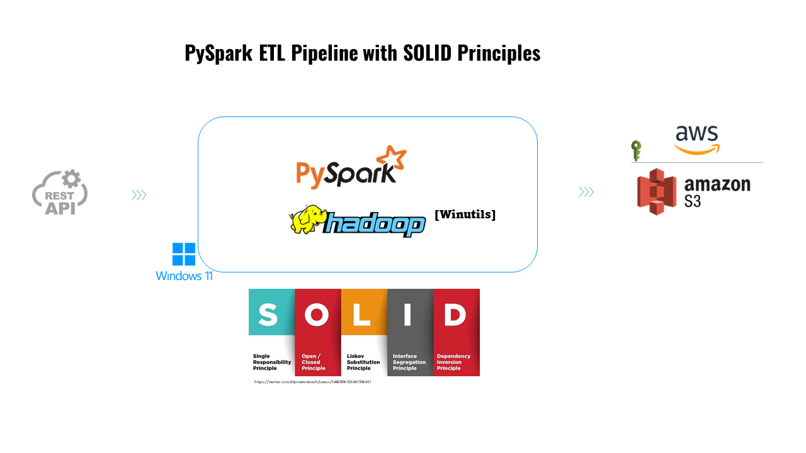

# Spark Crime ETL

This project implements an Extract, Transform, and Load (ETL) process for crime data in Chicago using Apache Spark. The solution is designed to facilitate data analysis and support data-driven decision-making, adhering to the SOLID principles for better software architecture.

## Description

`spark_etl_solid` uses PySpark to process crime data provided by the [City of Chicago's open data portal](https://data.cityofchicago.org/Public-Safety/Crimes-2001-to-Present/ijzp-q8t2/about_data). The project includes automatic data downloading, processing to add timestamps, grouping information by day of the week, and saving the processed data to AWS S3 in Parquet format.

## Features

- **Automatic data download**: The script checks if the CSV file already exists; if not, it downloads it automatically.
- **Data processing with PySpark**: Uses Spark to transform data, including date format conversions and aggregations.
- **Data storage**: Saves processed data to AWS S3 in Parquet format.

## Project Structure

```
solid_etl_spark/
│
├── .venv/ # Virtual environment
├── config/ # Configuration module
│ ├── init.py
│ └── config.py # Project configurations
├── containers/ # Dependency injection containers
│ ├── init.py
│ └── containers.py
├── data/
│ ├── output/ # Directory for output data
│ └── Chicago_crime_data.csv# Sample data file
├── decorators/ # Decorators for logging and timing
│ ├── init.py
│ └── decorators.py
├── etl/ # ETL process scripts
│ ├── init.py
│ └── main.py # Main script that runs the ETL process
├── extractors/ # Data extraction module
│ ├── init.py
│ └── data_loader.py # Module to load and download data
├── test/ # Test scripts
│ └── init.py
├── transformers/ # Data transformation module
│ ├── init.py
│ └── spark_manager.py # Manages Spark sessions and operations
├── .env # File for environment variables
├── .gitignore # Specifies files to be ignored in git
├── etl.log # Log file
├── README.md # This file
└── requirements.txt # Python dependencies
```

## Setup

1. **Install Dependencies**:
   - Ensure Python and Apache Spark are installed.
   - Install necessary Python dependencies:
     ```bash
     pip install -r requirements.txt
     ```

2. **Environment Variables**:
   - Set up required variables in the `.env` file at the project root.

## Usage

To run the project, navigate to the project root directory and execute:

```bash
python etl/main.py
```

## License

This project is licensed under the MIT License - see the `LICENSE` file for details.

## NOTES

- Ensure that AWS credentials are properly configured to allow access to S3.
- Adjust Spark configurations if necessary to optimize performance for larger datasets.
