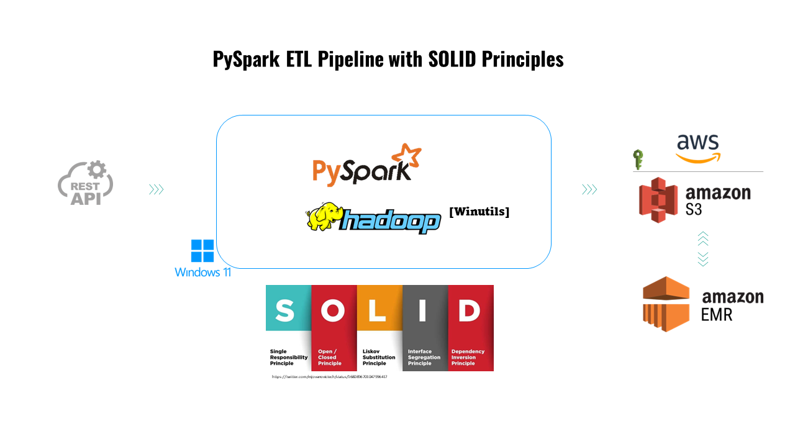

# Spark Crime ETL

This project implements an Extract, Transform, and Load (ETL) process for crime data in Chicago using Apache Spark. The solution is designed to facilitate data analysis and support data-driven decision-making, adhering to the SOLID principles for better software architecture.

## Description

`spark_etl_solid` uses PySpark to process crime data provided by the [City of Chicago's open data portal](https://data.cityofchicago.org/Public-Safety/Crimes-2001-to-Present/ijzp-q8t2/about_data). The project includes automatic data downloading, processing to add timestamps, grouping information by day of the week, and saving the processed data to AWS S3 in Parquet format.
At the same time, this project ables to create an EMR-cluster directly running the whole project or just running the emr-setup module separately. 
**Disclaimer:** Although the code creates an emr-cluster succesfully, the steps initialization must to be fixed up.

## Features

- **Automatic data download**: The script checks if the CSV file already exists; if not, it downloads it automatically.
- **Data processing with PySpark**: Uses Spark to transform data, including date format conversions and aggregations.
- **Data storage**: Saves processed data to AWS S3 in Parquet format or locally based on user preference.
- **Flexible data source and storage selection**: 
  - Use the `--use-s3` parameter to specify whether to load data from local files or from S3.
  - Use the `--save-local` parameter to specify whether to save processed data locally or on S3.
 ```bash
python main.py --use-s3 
```
## Project Structure

```

solid_etl_spark/
│
├── src/
│   ├── __init__.py
│   ├── main.py
│   ├── containers.py

│   ├── aws_queries/

├── data/
│ ├── output/
│ └── Chicago_crime_data.csv
  └── police-station.csv

│   ├── data
│   └── output/
│   └── Chicago_crime_data.csv
│   └── police-station.csv

│   ├── decorators
│   └──__init_.py
│   └── decorators.py

│   ├── emr_setup
│   └──__init_.py

│   ├── extractors
│   └──__init_.py
│   └── data_loader.py

│   ├── interfaces
│   └──__init_.py
│   └── i_data_transformer.py
│   └── i_spark_session_manager.py
│   └── i_storage_manager.py

│   ├── managers
│   └──__init_.py
│   └── data_transformer.py
│   └── local_storage_manager.py
│   └── s3_storage_manager.py
│   └── spark_session_manager.py

│   ├── s3_upload/
│   └──__init_.py
│   └── s3_uploader.py
│
├── test
│   └──__init_.py
│   └── mock_storage_manager.py

├── .env
├── .gitignore
├── requirements.txt
└── README.md

```

## Setup

1. **Install Dependencies**:
   - Ensure Python and Apache Spark are installed.
   - Install necessary Python dependencies:
     ```bash
     pip install -r requirements.txt
     ```

2. **Environment Variables**:
   - Set up required variables in the `.env` file at the project root.

## Usage

To run the project, navigate to the project root directory and execute:

```bash
python src/main.py --use-s3
```
or if you want to load data from local files, do not include the flag:
```bash
python src/main.py
```

## License

This project is licensed under the MIT License - see the `LICENSE` file for details.

## NOTES

- Ensure that AWS credentials are properly configured to allow access to S3.
- Adjust Spark configurations if necessary to optimize performance for larger datasets.
